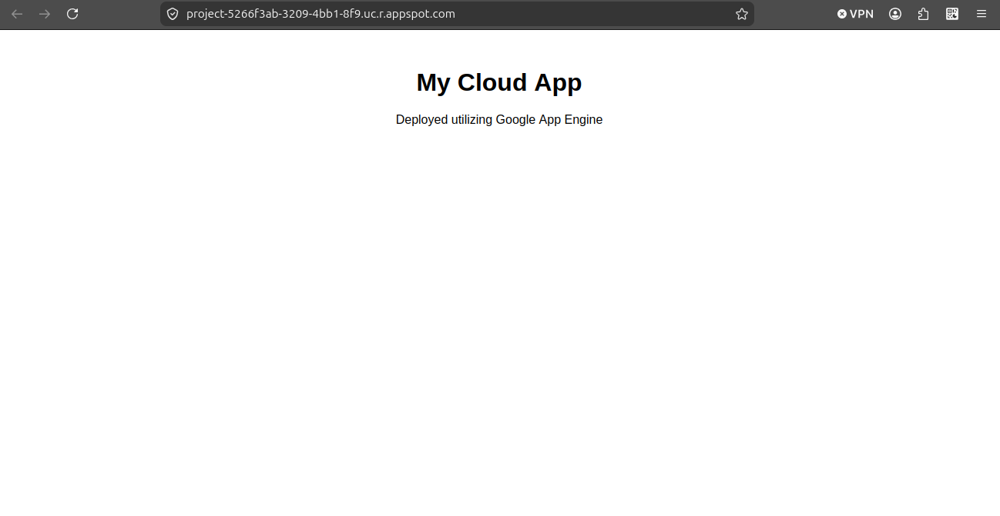
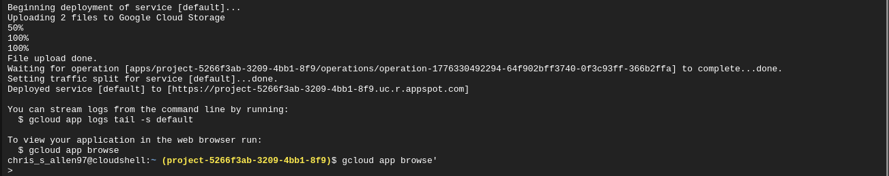

# ⚙️ Project 2 - App Engine Deployment (GCP)

## 📌 Project Goal

Deploy a Python web application using Google App Engine and make it publicly accessible through a web browser.

---

# 🏗️ What I Built

In this project I deployed a Python web application using Google App Engine.

The deployment process included:

- Creating application files inside Cloud Shell
- Configuring the Python runtime
- Defining the application entrypoint
- Deploying the application to App Engine
- Troubleshooting deployment and IAM permission issues

This project demonstrates Platform as a Service (PaaS) deployment inside Google Cloud Platform.

---

# ⚙️ Tools & Services Used

- Google Cloud Platform (GCP)
- Google App Engine
- Cloud Shell
- Python
- Flask
- IAM
- Cloud Build

---

# 🧠 How It Works

Google App Engine is a managed application hosting platform.

Instead of manually managing:
- virtual machines
- operating systems
- web servers

Google automatically manages the infrastructure while developers focus on deploying application code.

Steps completed:

1. Created Python application files
2. Configured requirements.txt
3. Configured application runtime
4. Configured application entrypoint
5. Deployed application using Cloud Shell
6. Fixed IAM permission issues
7. Troubleshot deployment and build errors
8. Verified public web access

This deployment model is commonly used for scalable web applications and backend services.

---

# 🖥️ Screenshots

## Google App Engine Application

## Google Cloud Shell Deployment

---

# 🔑 Key Takeaways

- Learned how Platform as a Service (PaaS) works
- Practiced deploying Python applications in the cloud
- Learned how IAM permissions affect deployments
- Gained troubleshooting experience with cloud build failures
- Understood why requirements.txt is required for Python dependency installation
- Learned how managed cloud platforms reduce infrastructure management responsibilities

---

# 🎯 Interview Questions

### What is Google App Engine?

Google App Engine is a Platform as a Service (PaaS) offering that allows developers to deploy applications without managing servers directly.

---

### What is the advantage of PaaS?

PaaS platforms simplify deployment by automatically managing:
- servers
- scaling
- operating systems
- runtime environments

---

### Why was requirements.txt important?

requirements.txt defines Python dependencies that must be installed for the application to run correctly.

---

### Why did IAM permissions matter during deployment?

The deployment process interacts with multiple GCP services. Without the correct IAM permissions, Cloud Build and deployment operations can fail.

---

### What is Cloud Shell?

Cloud Shell is a browser-based command-line environment that provides authenticated access to Google Cloud resources and tools.

---

# ✅ Summary

In this project I deployed a Python web application using Google App Engine. I configured the runtime environment, deployed the application through Cloud Shell, troubleshot IAM and dependency issues, and verified public application access through a browser.
