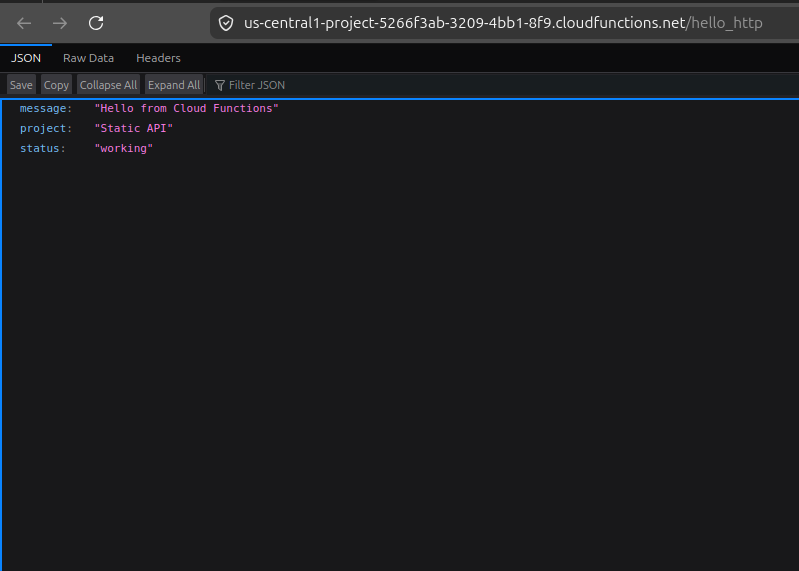
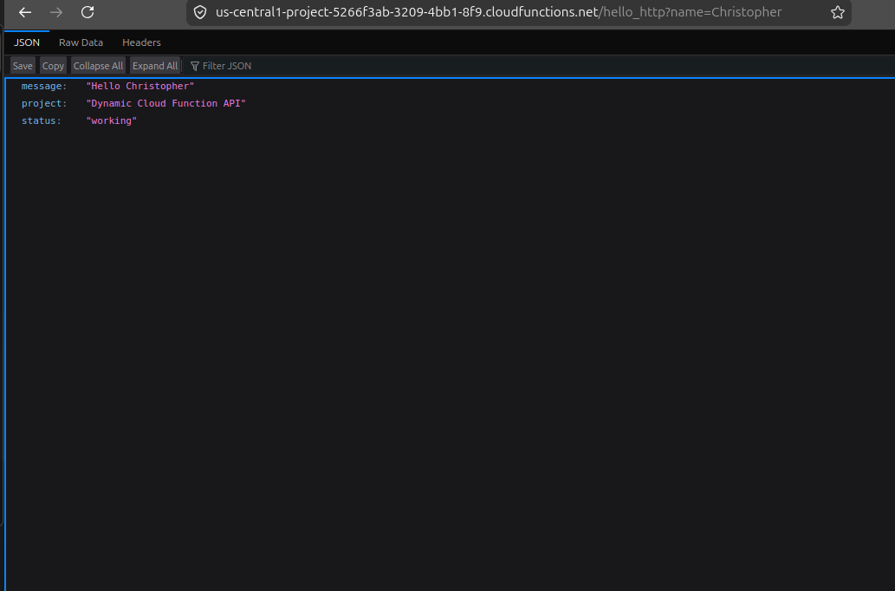

# ⚡ Project 3 - Cloud Function Dynamic API (GCP)

## 📌 Project Goal

Create a serverless Dynamic API using Google Cloud Functions.

---

# 🏗️ What I Did

- Created a Python Cloud Function using Cloud Shell
- Deployed the function using the gcloud CLI
- Configured an HTTP trigger for public access
- Fixed IAM permission issues during deployment
- Updated the function to read query parameters from the URL
- Returned dynamic JSON responses based on user input
- Tested the API with different names directly in the browser

---

# ⚙️ Tools & Services Used

- Google Cloud Platform (GCP)
- Google Cloud Functions
- Cloud Shell
- Python
- JSON
- IAM Permissions
- gcloud CLI

---

# 🧠 How It Works

This project uses a serverless Google Cloud Function that runs only when triggered through an HTTP request.

The function reads a query parameter from the URL and dynamically returns JSON data based on the provided input.

Example:

```text
https://FUNCTION-URL?name=Christopher
```

# 🖥️ Screenshots






---


```

---

# 🔑 What I Learned

- The difference between static and dynamic APIs
- How query parameters work
- How JSON returns structured data
- How serverless functions run on demand
- How IAM permissions affect deployments
- How Cloud Functions differ from App Engine

---

# 🎯 Interview Questions

### What is an API?

An API (Application Programming Interface) allows systems and applications to communicate with each other.

---

### What makes this API dynamic?

The API changes its response based on the query parameter provided in the URL.

---

### What are query parameters?

Query parameters are values passed through the URL that allow applications to send input data to an API.

---

### What is serverless computing?

Serverless computing allows code to run on demand without manually managing servers or infrastructure.

---

### What is JSON?

JSON (JavaScript Object Notation) is a lightweight structured data format commonly used in APIs.

---

### How is Cloud Functions different from App Engine?

Cloud Functions run individual functions on demand while App Engine is designed for hosting full applications.

---

# ✅ Summary

In this project I created a serverless Dynamic API using Google Cloud Functions. I deployed the function using Cloud Shell and the gcloud CLI, configured HTTP access, fixed IAM permission issues, and built a dynamic JSON API that responds to query parameters provided in the URL.
