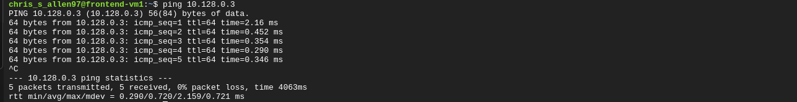

# 🌐 Project 4 - VPC Networking Lab (GCP)

## 📌 Project Goal

Create a multi-tier networking environment in Google Cloud Platform using two virtual machines inside the same VPC network. Test internal communication, SSH access, and backend service connectivity using internal IP addresses.

---

# 🏗️ What I Built

In this project I created:

- A frontend virtual machine
- A backend virtual machine
- Internal VPC communication between both systems
- SSH connectivity between VMs
- A simulated backend service running internally

This project demonstrates how cloud systems communicate privately inside a virtual network instead of relying on public internet traffic.

---

# ⚙️ Tools & Services Used

- Google Cloud Platform (GCP)
- Compute Engine
- Virtual Private Cloud (VPC)
- Cloud Shell
- Debian Linux
- SSH
- Python HTTP Server

---

# 🧠 How It Works

The frontend VM communicates with the backend VM using internal IP addresses inside the same VPC network.

Architecture:

Frontend VM → Internal Network → Backend VM

Steps completed:

1. Created frontend virtual machine
2. Created backend virtual machine
3. Verified internal IP communication using ping
4. Configured SSH authentication between VMs
5. Connected from frontend VM to backend VM
6. Started internal backend web service
7. Accessed backend service internally using curl

This simulates how frontend systems communicate with backend application servers inside real cloud environments.

---

# 🖥️ Screenshots

## Frontend VM Created

## Backend VM Created

## VM Network Overview

## Frontend VM Ping Backend VM

## Frontend SSH to Backend VM

## Frontend Accessing Backend Service

---

# 🔑 Key Takeaways

- Learned how internal cloud networking works
- Practiced SSH administration between Linux servers
- Understood the difference between internal and external IP addresses
- Used Cloud Shell for centralized infrastructure management
- Simulated real multi-tier cloud architecture
- Verified internal service communication inside a VPC

---

# 🎯 Interview Questions

### What is a VPC?

A VPC (Virtual Private Cloud) is a logically isolated network environment inside the cloud where resources can communicate securely.

---

### Why use internal IP addresses instead of external IPs?

Internal IPs keep traffic inside the cloud network which improves security, reduces exposure to the internet, and lowers latency.

---

### Why did ping work before SSH worked?

Ping uses ICMP traffic while SSH requires authentication using SSH keys and firewall access.

---

### What is the purpose of SSH keys?

SSH keys provide secure passwordless authentication between systems.

---

### Why are backend systems usually restricted?

Backend systems often contain internal services, APIs, or databases that should not be publicly accessible from the internet.

---

# ✅ Summary

In this project I built a multi-tier networking environment inside Google Cloud Platform using two Linux virtual machines connected through a shared VPC network. I tested internal communication, SSH administration, and backend service connectivity using internal cloud networking concepts commonly used in real-world infrastructure environments.
