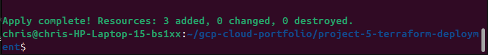
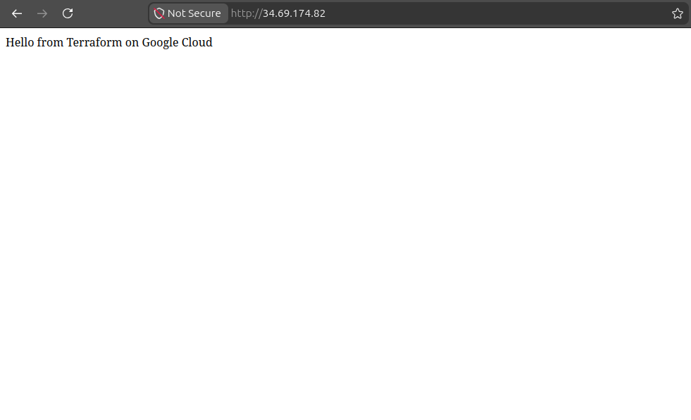

# 🚀 Project 5 - Terraform Deployment (GCP)

## 📌 Project Goal

Deploy cloud infrastructure automatically in Google Cloud Platform using Terraform Infrastructure as Code (IaC).

---

# 🏗️ What I Built

In this project I used Terraform to automatically provision:

- A Google Cloud virtual machine
- A VPC network
- Firewall rules
- A web server using a startup script

The deployment was fully automated through Terraform configuration files instead of manually creating resources through the Google Cloud Console.

---

# ⚙️ Tools & Services Used

- Google Cloud Platform (GCP)
- Terraform
- Compute Engine
- VPC Networking
- Firewall Rules
- Debian Linux
- Apache Web Server
- Cloud Shell

---

# 🧠 How It Works

Terraform uses configuration files written in HashiCorp Configuration Language (HCL) to define cloud infrastructure.

Instead of manually clicking through the cloud console, Terraform automates the deployment process by communicating directly with Google Cloud APIs.

Steps completed:

1. Created Terraform configuration file
2. Initialized Terraform provider plugins
3. Created execution plan using terraform plan
4. Automatically provisioned infrastructure using terraform apply
5. Deployed Apache web server with startup script
6. Verified website accessibility through public IP

This project demonstrates Infrastructure as Code automation commonly used in modern cloud engineering environments.

---

# 🖥️ Screenshots

## Terraform Apply Successful

## Terraform VM Instance

## Terraform Hosted Webpage

---

# 🔑 Key Takeaways

- Learned Infrastructure as Code (IaC) concepts
- Automated cloud deployments using Terraform
- Understood Terraform workflow:
  - terraform init
  - terraform plan
  - terraform apply
- Used startup scripts to automate server configuration
- Reduced manual cloud deployment steps
- Practiced cloud automation and repeatable infrastructure deployment

---

# 🎯 Interview Questions

### What is Infrastructure as Code (IaC)?

Infrastructure as Code is the process of managing and provisioning infrastructure through code instead of manual configuration.

---

### Why do companies use Terraform?

Terraform provides automation, consistency, repeatable deployments, and reduces human error in cloud infrastructure management.

---

### What does terraform init do?

terraform init initializes the working directory and downloads required provider plugins.

---

### What is the purpose of terraform plan?

terraform plan previews infrastructure changes before deployment.

---

### What does terraform apply do?

terraform apply creates or modifies infrastructure based on the Terraform configuration files.

---

### Why is automation important in cloud engineering?

Automation improves deployment speed, consistency, scalability, and reduces configuration mistakes.

---

# ✅ Summary

In this project I used Terraform to automate the deployment of cloud infrastructure in Google Cloud Platform. I provisioned a virtual machine, networking components, firewall rules, and a web server entirely through Infrastructure as Code principles instead of manual cloud console configuration.
